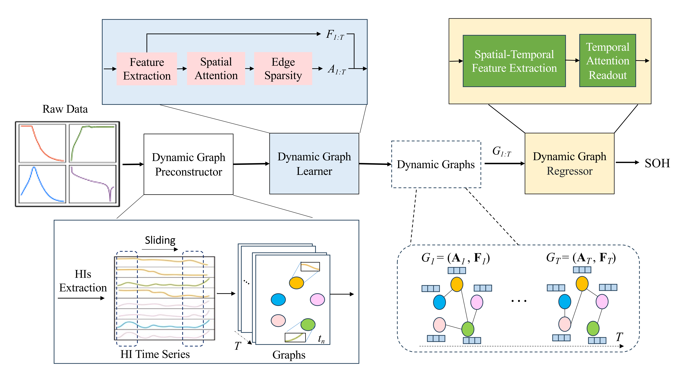

# DGL-STFA: State of health prediction for lithium-ion battery based on dynamic graph neural network with spatial-temporal fusion attention

This is a PyTorch implementation of DGL-STFA model and discussion experiments proposed by our paper "DGL-STFA: State of health prediction for lithium-ion battery based on dynamic graph neural network with spatial-temporal fusion attention".

## 1.Overview

Fig.1 An overview of Minimal model.

We propose a novel framework DGL-STFA to predict the SOH of LIBs, considering the spatial-temporal characteristics of HIs. It can model the evolving relationships between HIs, thus achieving more accurate SOH predictions. We designed a graph structure learner that dynamically adjusts the graph structure based on the evolving characteristics of the data, enabling it to capture the patterns and correlations between HIs that change over time. Additionally, it combines spatial attention and learnable edge sparsity to enhance predictive performance. A dynamic graph regressor is proposed, using a graph convolutional recurrent network (GCRN) to extract the spatial-temporal features of the HI time series. A temporal attention readout layer is also introduced to dynamically emphasize the most relevant time periods.

## 2.Requirements
- torch==1.13.1
- torch-geometric==2.2.0
- scikit-learn==1.3.2
- PyYAML==5.3.1
- ....

You can install it directly from the environment pack version file:
```
pip install -r requirements.txt
```

## 4.Training and Testing
You can perform SOH prediction on two datasets in the two files: 'NASAMain.ipynb', 'CALCEMain.ipynb'. 
